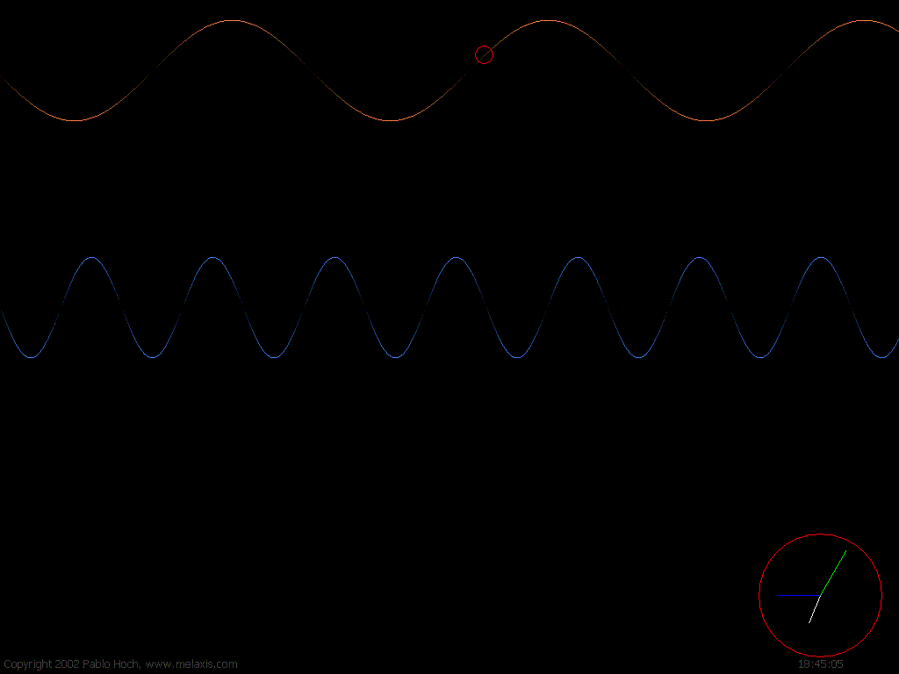



## Sine ScreenSaver

### Description

A simple screensaver. You'll see a moving sine curve with a ball on it, a stretching sine curve and a clock. This screensaver also supports the preview mode (you can see this in the control panel where you choose your screensaver) and has a config window (just a little about-box).
 
### More Info
 
If you want to use this as your screensaver, put it into your windows directory.

             |
---                |---
**Submitted On**   |2002-04-19 18:41:50
**By**             |[Pablo Hoch](https://github.com/Planet-Source-Code/PSCIndex/blob/master/ByAuthor/pablo-hoch.md)
**Level**          |Intermediate
**User Rating**    |5.0 (30 globes from 6 users)
**Compatibility**  |VB 6\.0
**Category**       |[Graphics](https://github.com/Planet-Source-Code/PSCIndex/blob/master/ByCategory/graphics__1-46.md)
**World**          |[Visual Basic](https://github.com/Planet-Source-Code/PSCIndex/blob/master/ByWorld/visual-basic.md)
**Archive File**   |[Sine\_Scree736224192002\.zip](https://github.com/Planet-Source-Code/pablo-hoch-sine-screensaver__1-33947/archive/master.zip)

### API Declarations

see code

